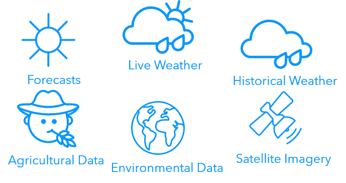
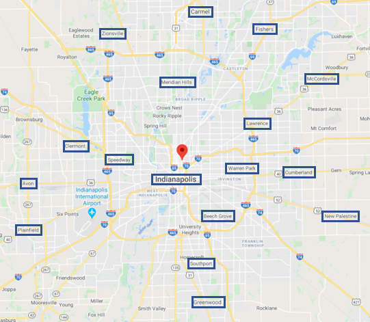
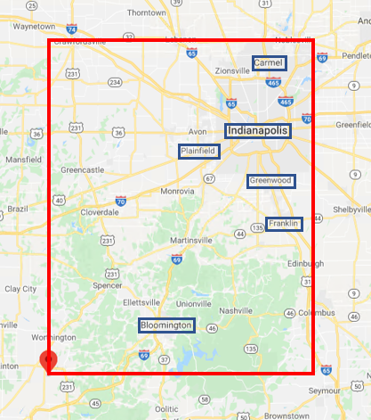
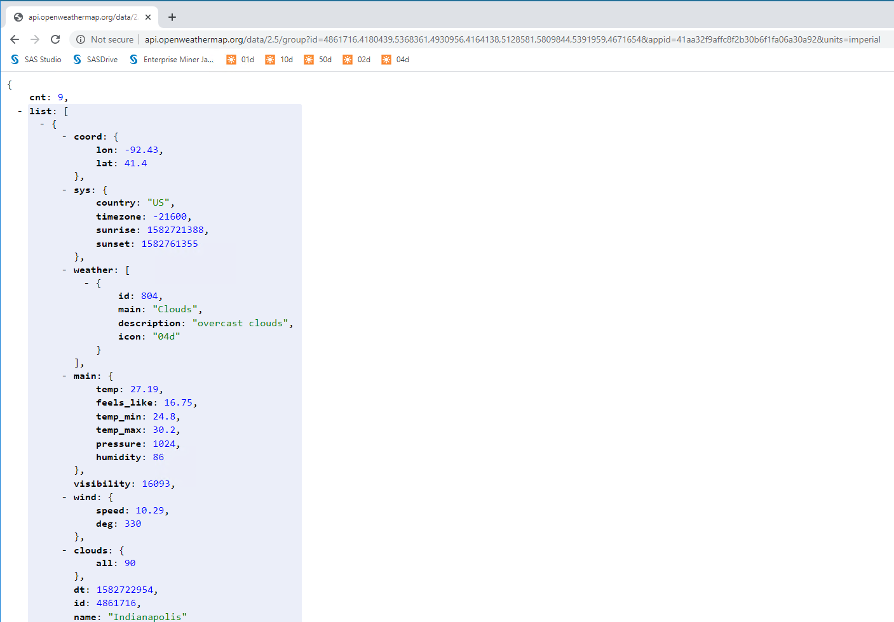
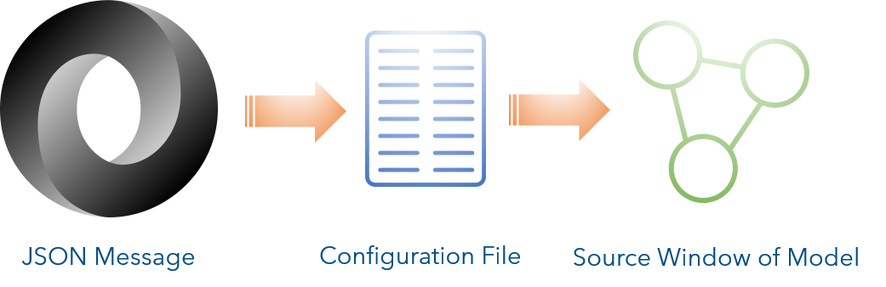
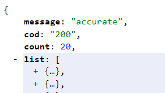
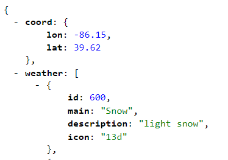
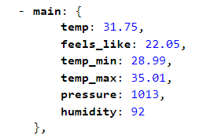

# Streaming Live Weather Data

In this repository you will learn how to stream live weather data into any [SAS Event Stream Processing](https://www.sas.com/en_us/software/event-stream-processing.html) (ESP) model. The repository also includes an [examples](examples) directory that contains sets of configuration, model, and output files.

## What You Will Learn

* How to use a URL connector to connect to an http server
* How to construct API calls to publish live weather data
* How to use event loop technology to transpose a JSON message itno ESP events
* How to pass a parameter to a model

[](https://players.brightcove.net/3665946608001/default_default/index.html?videoId=6156145717001 "Streaming Live Weather Data")

## Overview

Live weather data from a variety of sources can be streamed into any ESP model.

### Live Weather Data

This example will work with any weather service that returns a JSON message by way of an API call. A variety of sources are available and most sources have free and subscription accounts.
I am using [OpenWeather](https://openweathermap.org) for my examples. [OpenWeather](https://openweathermap.org) provides a set of APIs that allow you to access live weather data, historical weather data, satellite imagery, and even environmental and agricultural data. 



#### APPID

[OpenWeather](https://openweathermap.org) requires an APPID used in the API calls to provide access. To request your free APPID go to [https://openweathermap.org/api](https://openweathermap.org/api).

### APIs

The Application Programming Interface (API) allows you to send server requests to a data source server. This is done by way of the http protocol by adding endpoints to a URL. This is also known as an API call.

#### API Call Structure

The following is the structure of an API call to OpenWeather:

```
uniform-resource-locator?key1=value1&key2=value2&key3=value3…
```

The portion of the API call before the ? is the URL of the server to which we are making requests. The portion following the ? contains key-value pairs to pass parameters to the server. The following shows an example of an API call:

```http
http://api.openweathermap.org/data/2.5/weather?zip=46142&appid=@APPID@&units=imperial
```

where:

* `http://api.openweathermap.org/data/2.5/weather` is the URL of the server to which we are making requests
 
* `zip=46142` is the Zip Code of the location requested

* `appid=@APPID@` is the APPID used to provide access. The value is supplied when the model is executed.

* `units=imperial` specifies to use imperial units of measure

#### Single Location API Calls

Live weather data is available for a single location or multiple locations with a single request. The following are examples of single location API calls:

##### Zip Code

You can provide the Zip Code of U.S. cities as a parameter:

```http
http://api.openweathermap.org/data/2.5/weather?zip=46142&appid=@APPID@&units=imperial
```

##### Geographic Coordinates

You can use geographic coordinates (i.e., latitude, longitude) to specify a location:

```http
http://api.openweathermap.org/data/2.5/weather?lat=-86&lon=40&appid=@APPID@&units=imperial
```

##### City ID

OpenWeather provides a city.list.json file that lists the City IDs for locations globally. You can use City ID in an API Call:

```http
http://api.openweathermap.org/data/2.5/weather?id=4258313&appid=@APPID@&units=imperial
```

#### Multiple Locations API Calls

You can also request multiple locations in a single API call. When you do so the JSON message returned includes an array of cities.

##### Group of Locations

You can provide a comma-separated list of City IDs to request multiple locations:

```http
http://api.openweathermap.org/data/2.5/group?id=4861716,4180439,5368361&appid=@APPID@&units=imperial
```

##### Locations Within a Circle

You can enter the latitude and longitude of a center point, followed by the number of locations you want, to form a circle of cities:

```http
http://api.openweathermap.org/data/2.5/find?lat=-86&lon=40&cnt=20&appid=@APPID@&units=imperial
```

Here is a map of locations returned from this example.



##### Locations Within a Rectangle

You can also specify the coordinates of the lower left and upper right corners of a bounding box, and the zoom factor to request locations in a rectangle:

```http
http://api.openweathermap.org/data/2.5/box/city?bbox=-86,40,-87,39,10&appid=@APPID@&units=imperial
```

Here is a map of the cities returned in the above example:



#### Testing API Calls
Any API call can be tested in a browser by entering the API call in the Address bar. You must substitute your actual APPID for the @APPID@ parameter value. You can also use a Chrome extension named JSONView to format the JSON message.



#### Publishing Data from a URL

ESP includes a URL connector to publish data from a URL into a model.



A source window is used in the model to provide a schema for the data and an input data connector (class is URL) that points to an external configuration file. The following is an example of the input data connector:

```xml
  <connector class='url'>
    <properties>
      <property name='type'>pub</property>
      <property name='configUrl'>file:///home/sasdemo/weather/config.xml</property>
      <property name='properties'>APPID=@appid@</property>
    </properties>
  </connector>
```

The configuration file contains the actual URL connector. It requests the data using an API call, transforms the data, and publishes events to the model. The following is an example of a configuration file:

```xml
<url-connector>
  <url-publishers>
    <url-publisher name='weather'>
      <requests>
        <request name="weather">
          <url><![CDATA[http://api.openweathermap.org/data/2.5/find?lat=39.791&lon=-86.148&cnt=20&APPID=@APPID@&units=imperial]]></url>
        </request>
      </requests>
      <generate>0</generate>
      <opcode>upsert</opcode>
      <event-loops>
        <event-loop-json name='loop'>
          <use-json>#_content</use-json>
          <json>$.list</json>
          <function-context>
            <functions>
              <function name='id'>json(#_context,'id')</function>
              <function name='name'>json(#_context,'name')</function>
              <function name='dt'>json(#_context,'dt')</function>
              <function name='weather'>json(#_context,'weather.description')</function>
              <function name='temp'>json(#_context,'main.temp')</function>
              <function name='tempMin'>json(#_context,'main.temp_min')</function>
              <function name='tempMax'>json(#_context,'main.temp_max')</function>
              <function name='pressure'>json(#_context,'main.pressure')</function>
              <function name='humidity'>json(#_context,'main.humidity')</function>
              <function name='windSpeed'>json(#_context,'wind.speed')</function>
              <function name='windDirection'>json(#_context,'wind.deg')</function>
              <function name='rain'>json(#_context,'rain.1h')</function>
              <function name='clouds'>json(#_context,'clouds.all')</function>
              <function name='lat'>json(#_context,'coord.lat')</function>
              <function name='lon'>json(#_context,'coord.lon')</function>
            </functions>
          </function-context>
        </event-loop-json>
      </event-loops>
    </url-publisher>
  </url-publishers>
</url-connector>
```

#### JSON Message to ESP Mapping

JSON messages returned from an API call contain 0 to many events in a single message. Event loop technology in the configuration file is used to transform the message into event fields readable by ESP. Additionally, the schema in the source window of the model must coincide with the configuration file.

##### Event Loop Control

The event loop in the configuration file reads the JSON message and transforms it into events readable by ESP. If the JSON message contains an array of locations, the event loop will iterate for each member of the array. If a single location is returned an no array exists in the JSON message, the event loop needs to read the message once.

If multiple locations are returned, the JSON message contains an array named list with a count element indicating how many members are in the array.



The `<json>` element in the configuration file controls iterations of the event loop. To match the abover JSON message, the `<json>` element would be:

```xml
<json>$.list</json>
```

If a single location is returned, there is no array in the JSON message.



Therefore, the `<json>` element uses `$` alone to tell the event loop to read the message once from the root:

```xml
<json>$</json>
```

##### Field Transformation

Each JSON message field desired must be transformed into an event field readable by ESP. This is controlled by functions within the function context of the configuration file.

###### Example 1


To transform JSON message field weather description, use the following function in the configuration file:

```xml
<function name='weather'>json(#_context,'weather.description')</function>
```

This will create a field named weather by reading weather.description from the JSON message. The schema of the source window in the model must include a field named weather:

```xml
<field name='weather' type='string' />
```

###### Example 2

In this example the temp field is transformed into a data type of double.



The function in the configuration file would be:

```xml
<function name='temp'>json(#_context,'main.temp')</function>
```

The field in the schema of the source window would be:

```xml
<field name='temp' type='double' />
```

### Prerequisites

SAS Event Stream Processing 6.2

APPID from [OpenWeather](https://openweathermap.org/api).

### Running

**Note** There are several examples of configuration files with matching models for you to use in the [examples](/examples) directory.

1.  Test the API call in a browser to ensure it works correctly.

2.  Edit the configuration xml file:
    a.  Include the API call.
    b.  Edit the <json> element to control the event loop.
    c.  Map the JSON message fields in the function context.

3.  Edit the model xml file:
    a.  Ensure the schema coincides with the mappings in the configuration file.
    b.  Edit the connector to point to the appropriate configuration file.

4.  Upload the configuration and model files.

5.  Start the model on the ESP XML Server using the following command:

```bash
$DFESP_HOME/bin/dfesp_xml_server -model file://path/model_by_group.xml -http 61001 -pubsub 61002 -appid 41aa32f9affc8f2b30b6f1fa06a30a92
```

The examples have an output data connector to create a csv file from the output.

### Examples

There are several sets of configuration, model, and output files included in the [examples](examples) directory.

## Contributing

> We welcome your contributions! Please read [CONTRIBUTING.md](CONTRIBUTING.md) for details on how to submit contributions to this project. 

## License

> This project is licensed under the [Apache 2.0 License](LICENSE).

## Additional Resources

* [SAS Event Stream Processing 6.2 Product Documentation](https://go.documentation.sas.com/?cdcId=espcdc&cdcVersion=6.2&docsetId=espov&docsetTarget=home.htm&locale=en)
